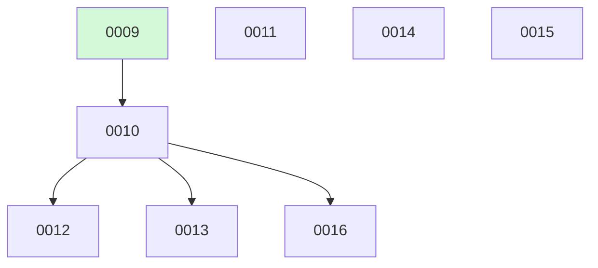

# Backlog

**16 changes** — 🟡 6 proposed · 🔵 1 implemented · ✅ 9 done

## 🟡 Proposed (6)

| # | Title | Priority | Type | Readiness |
|---|-------|----------|------|-----------|
| [0011](active/0011-curated-feed-expansion.md) | Add verified curated feeds — newsletters + Lobste.rs | `medium` | `chore` | build-ready |
| [0012](active/0012-semantic-scholar-adapter.md) | Semantic Scholar keyword-search adapter | `medium` | `feat` | ⏳ waiting on #10 — needs your merge |
| [0013](active/0013-bluesky-author-feeds.md) | Bluesky author-feed adapter with researcher registry | `medium` | `feat` | ⏳ waiting on #10 — needs your merge |
| [0014](active/0014-cross-source-corroboration-ranking.md) | Cross-source corroboration + citation-velocity signals | `medium` | `feat` | needs-brainstorm |
| [0015](active/0015-embedding-topic-prefilter.md) | Embedding-based topic pre-filter (replace/augment regex filter) | `medium` | `feat` | needs-brainstorm |
| [0016](active/0016-hf-trending-artifacts.md) | Hugging Face trending models/datasets adapter | `medium` | `feat` | ⏳ waiting on #10 — needs your merge |

## 🔵 Implemented — awaiting merge (1)

| # | Title | Priority | Type | PR | Readiness |
|---|-------|----------|------|----|-----------|
| [0010](active/0010-expand-article-sources.md) | Expand article sources — HF daily papers, arXiv keyword search, GitHub trending, wired SourceDiscovery | `medium` | `feat` | [#10](https://github.com/ethanhinson/llm-research-agent/pull/10) |  |

✅ Archive — done (9)

| # | Title | Merged |
|---|-------|--------|
| [0009](archive/2026-08-07-0009-source-adapter-layer.md) | Unify article intake behind a SourceAdapter layer | 2026-08-07 |
| [0008](archive/2026-08-07-0008-openrouter-provider-support.md) | OpenRouter provider support — full-system alternative to the Anthropic API | 2026-08-07 |
| [0007](archive/2026-08-07-0007-full-content-note-synthesis.md) | Full-content retrieval + LLM note synthesis | 2026-08-07 |
| [0006](archive/2026-08-07-0006-llm-topic-tags.md) | LLM-generated freeform topic tags | 2026-08-07 |
| [0005](archive/2026-08-07-0005-retroactive-reclassify-vault-notes.md) | Retroactive re-classification of existing vault notes | 2026-08-07 |
| [0004](archive/2026-08-03-0004-multi-type-content-evaluation.md) | Multi-type content evaluation — expand tagging beyond novelty | 2026-08-03 |
| [0003](archive/2026-08-02-0003-fix-apscheduler-weekday-name.md) | Fix APScheduler weekday name crash — "sunday" → "sun" | 2026-08-02 |
| [0002](archive/2026-08-02-0002-multi-backend-web-search.md) | Multi-Backend Web Search — continuous internet search across Tavily, Bing, and SerpAPI | 2026-08-02 |
| [0001](archive/2026-08-02-0001-llm-research-agent.md) | LLM Research Agent — Reddit/HN/arXiv monitor with Obsidian vault output | 2026-08-02 |

