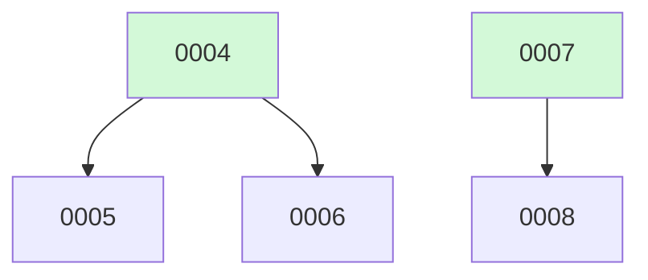

# Backlog

**8 changes** — 🟢 1 in progress · 🟡 2 proposed · ✅ 5 done

## 🟢 In progress (1)

| # | Title | Priority | Type | Spec | Branch |
|---|-------|----------|------|------|--------|
| [0005](active/0005-retroactive-reclassify-vault-notes.md) | Retroactive re-classification of existing vault notes | `medium` | `chore` | [spec](../superpowers/specs/2026-08-03-retroactive-reclassify-vault-notes.md) | `feat/retroactive-reclassify-vault-notes` |

## 🟡 Proposed (2)

| # | Title | Priority | Type | Readiness |
|---|-------|----------|------|-----------|
| [0006](active/0006-llm-topic-tags.md) | LLM-generated freeform topic tags | `medium` | `feat` | build-ready |
| [0008](active/0008-openrouter-provider-support.md) | OpenRouter provider support — full-system alternative to the Anthropic API | `medium` | `feat` | build-ready |

✅ Archive — done (5)

| # | Title | Merged |
|---|-------|--------|
| [0007](archive/2026-08-07-0007-full-content-note-synthesis.md) | Full-content retrieval + LLM note synthesis | 2026-08-07 |
| [0004](archive/2026-08-03-0004-multi-type-content-evaluation.md) | Multi-type content evaluation — expand tagging beyond novelty | 2026-08-03 |
| [0003](archive/2026-08-02-0003-fix-apscheduler-weekday-name.md) | Fix APScheduler weekday name crash — "sunday" → "sun" | 2026-08-02 |
| [0002](archive/2026-08-02-0002-multi-backend-web-search.md) | Multi-Backend Web Search — continuous internet search across Tavily, Bing, and SerpAPI | 2026-08-02 |
| [0001](archive/2026-08-02-0001-llm-research-agent.md) | LLM Research Agent — Reddit/HN/arXiv monitor with Obsidian vault output | 2026-08-02 |

