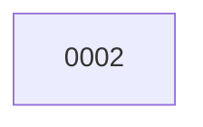

# Backlog

**2 changes** — 🔵 1 implemented · ✅ 1 done

## 🔵 Implemented — awaiting merge (1)

| # | Title | Priority | Type | PR | Readiness |
|---|-------|----------|------|----|-----------|
| [0002](active/0002-multi-backend-web-search.md) | Multi-Backend Web Search — continuous internet search across Tavily, Bing, and SerpAPI | `medium` | `feat` | [#2](https://github.com/ethanhinson/llm-research-agent/pull/2) |  |

✅ Archive — done (1)

| # | Title | Merged |
|---|-------|--------|
| [0001](archive/2026-08-02-0001-llm-research-agent.md) | LLM Research Agent — Reddit/HN/arXiv monitor with Obsidian vault output | 2026-08-02 |

