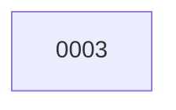

# Backlog

**3 changes** — 🔵 1 implemented · ✅ 2 done

## 🔵 Implemented — awaiting merge (1)

| # | Title | Priority | Type | PR | Readiness |
|---|-------|----------|------|----|-----------|
| [0003](active/0003-fix-apscheduler-weekday-name.md) | Fix APScheduler weekday name crash — "sunday" → "sun" | `high` | `fix` | [#3](https://github.com/ethanhinson/llm-research-agent/pull/3) |  |

✅ Archive — done (2)

| # | Title | Merged |
|---|-------|--------|
| [0002](archive/2026-08-02-0002-multi-backend-web-search.md) | Multi-Backend Web Search — continuous internet search across Tavily, Bing, and SerpAPI | 2026-08-02 |
| [0001](archive/2026-08-02-0001-llm-research-agent.md) | LLM Research Agent — Reddit/HN/arXiv monitor with Obsidian vault output | 2026-08-02 |

